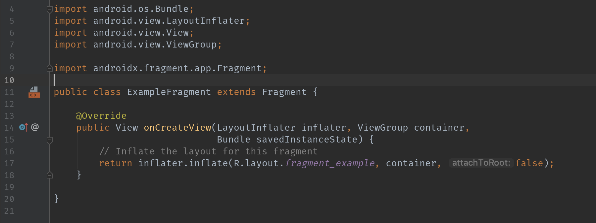

Up until now, we’ve just been working in a single screen.  Most likely, your app is going to have multiple different screens and you’ll need to navigate between them.  Today we’re going to talk about three big ideas: something called an Intent and something called a Fragment, and something everybody ends up having an opinion on: Architecture.

Those of you who were at our first workshop (or did it yourself) may remember this tag we saw in the AndroidManifest called `<intent-filter>`.  We can think of Intents as an action to be performed.  There are two main forms of an Intent: *implicit* and *explicit*.

### Implicit Intents

An implicit Intent is where you don’t know exactly where you want to go, or you want the user to choose.  This would be something like needing to send an email knowing that the user might have multiple email clients to choose from.  We would do this:

```java
Intent intent = new Intent(Intent.ACTION_SENDTO); //1
intent.setData(Uri.parse("mailto:")); //2
intent.putExtra(Intent.EXTRA_EMAIL, addresses); //3
intent.putExtra(Intent.EXTRA_SUBJECT, subject); //3
if (intent.resolveActivity(getPackageManager()) != null) { //4
    startActivity(intent); //5
}
```

What we’re doing here is:
1. Creating an Intent and saying that the action we want to do is a SENDTO (unique for email clients)
2. Setting the extra data that we need (the “mailto:” scheme is common for email).  setData expects a Uri in its field
3. Adding extra information via putExtra; we’re telling the Intent that these are the email addresses and the subject - they’ll auto-populate those fields whenever we launch the email client.
4. The if statement checks to see if there are any programs capable of handling this Intent.  We’ll crash if we launch this intent and there aren’t any viable options.
5. The call to startActivity will launch the new activity with our intent


### Explicit Intents

While implicit Intents are good to know, you'll typically use more explicit Intents.  An explicit Intent is where you know exactly what class you need to navigate to - usually an Activity.

Let’s create a SecondActivity and then navigate to it.

The simplest form of this would be:

`Intent intent = new Intent(this, SecondActivity.class)
startActivity(intent)`

The two Intent parameters here are a Context object (the Activity is a Context which is why we pass this) and the class to start.  We then call startActivity on that Intent and it will launch SecondActivity.

We’ve got the navigation part down, but what if we need to transfer some data as well? We’re grabbing a Username here - what if we need that username in the next Activity? That’s what the `putExtra` methods are for basically - adding any **EXTRA** data you need to send.

The Intent `putExtra` method is overloaded for every primitive data type (+ Strings) and primitive arrays (+ String arrays).  There’s also support for sending a [Parcelable](https://developer.android.com/reference/android/os/Parcelable), an interface that lets you send your own objects as Extras. You can see that each call to putExtra takes 2 arguments - a name and a value (if you’re familiar with Maps/HashMaps then it’s the same concept as key/value). The name is used to identify that piece of data since you’ll need a way to retrieve it in SecondActivity.  The value is the actual value of whatever you’re putting in as an extra.

If we wanted to grab the text from an `EditText` named `usernameEditText`, we could do it like this:

```java
//Declare a constant for username
public static final String USERNAME = “USERNAME”;

//Build the Intent
Intent intent = new Intent(this, SecondActivity.class);

//Put the username text into the Intent as an extra
intent.putExtra(USERNAME, usernameEditText.getText().toString());

//Start our new activity with the intent
startActivity(intent)
```

On the other end, in SecondActivity, we can grab this data by looking at the intent. The Activity has a method called `getIntent()` that will get us the intent that launched that Activity.  We can grab that Intent and get the extra.  Instead of having a lot of overloaded methods like putExtra, when you want to get an Extra you usually have to specify the method with the return type.  Since we’re getting a String, we’ll call `getStringExtra(MainActivity.USERNAME)` and that’ll give us the username we passed through the Intent. It would look something like this:

```java
public class SecondActivity extends AppCompatActivity {

    @Override
    protected void onCreate(Bundle savedInstanceState) {
        super.onCreate(savedInstanceState);
        setContentView(R.layout.activity_second);

        /* 
        get the intent with getIntent()
        and get the String extra with getStringExtra
        (it will return null if it can't find the extra)
        */
        String username = getIntent().getStringExtra(MainActivity.USERNAME);
    }
}
```

### Getting a Result from another Activity

Sometimes we’ll want to start an Activity, have that Activity do something, and then return something back to the original Activity.  There are a couple Activity methods we can make use of to handle this - `startActivityForResult` and `onActivityResult`.

Let’s use the example of taking a picture. Our app isn’t going to implement that whole thing most likely when we can just launch out to the Camera app and have it give us the picture back.

To do this, we’ll use an implicit Intent like we talked about earlier. To build that Intent out, we’d do:
```java
//Declare a constant for our image capture request code
static final int REQUEST_IMAGE_CAPTURE = 1;

//Create the implicit intent - here we create an Intent for Image Capture
Intent takePictureIntent = new Intent(MediaStore.ACTION_IMAGE_CAPTURE);

//This if statement checks that there's some activity on our phone that can handle the action we want to take
if (takePictureIntent.resolveActivity(getPackageManager()) != null) {
   //Instead of calling startActivity(takePictureIntent), we'll call startActivityForResult with our intent and our request code
   startActivityForResult(takePictureIntent, REQUEST_IMAGE_CAPTURE);
}
```

After we’ve taken our picture and come back to our original Activity, `onActivityResult` will get called.  We’ll need to make sure we override this method call so we can handle getting our picture back.  You’ll see that the method has 3 parameters - `requestCode`, `resultCode`, and `data`.  

```java
@Override
protected void onActivityResult(int requestCode, int resultCode, @Nullable Intent data) {
   //Make sure that it's our request by checking that the requestCode is REQUEST_IMAGE_CAPTURE and make sure that it succeeded by making sure that the resultCode is RESULT_OK
   if (requestCode == REQUEST_IMAGE_CAPTURE && resultCode == RESULT_OK) {
       //Since data is just an intent, we can get the bundle of extras by calling getExtras()
       Bundle extras = data.getExtras();

       //There's a field in there called "data" that's specific to the type of request we did for the camera, and we know that it's a Bitmap (basically an image)
       Bitmap imageBitmap = (Bitmap) extras.get("data");

       //Set our image into our ImageView
       imageView.setImageBitmap(imageBitmap);
   }
}
```

The requestCode is the same code we sent when we called startActivityForResult, so we’ll check to see that this result is from that request by making sure the requestCode is equal to the code we sent.

The resultCode is typically one of two constants defined in Activity - `RESULT_OK or `RESULT_CANCELED`.  We can check that the resultCode is `RESULT_OK` to make sure it succeeded.

Lastly, we have our Intent.  Similar to how we received an Intent when going into our second Activity, we receive an Intent in this method that holds out data.  In this case, the Intent has an Extra creatively named “data”, so let’s pull out the Extras Bundle and then grab the item associated with the “data” key.  This is going to be a Bitmap object, so we’ll cast it and then set it on our ImageView.

### Fragments

Now that we’ve talked about Activities and going back and forth, it’s time for something completely different.

Introducing Fragments. We can think of Fragments as pieces of an Activity that let us make a more modular, or flexible, design of our app. Activities are kinda like your main method with a lifecycle. Linking your UI to code, listening for events and updating based on those events...Activities can get REALLY big. Fragments can help split that up and make things more manageable.

It can also be more logical to think of things in the context of an overarching Activity and multiple Fragments. Let’s pretend we have some sort of login flow - we start at a login screen where we can enter our username and password.  Maybe we have some Forgot Password text we can click on to take us to password recovery, and we’ll also have a Create Account button we can click to create a whole new account, and maybe THAT Create Account flow has a bunch more screens (linking social media, initial settings, etc).  It’s a little much to have each of these screens be a separate Activity when they’re all linked by a concept of Login/Onboarding.  It might make more sense to have an OnboardingActivity and create each of these individual screens.  Fragments let us do this!

As a quick note, we won’t be working with tablets really but they’re important to keep in mind since their designs can be different.  This was another reason Fragments came about - the most common thing we see is something called a Master-Detail view where the Master view drills into the Detail view.  You can see this on your phone in GMail where there’s a list of conversations (the master), we tap on a conversation, and you’re taken to a new screen with that conversation (the detail).  Since we have so much more space on a tablet, we can take advantage of this by showing BOTH the master and detail at the same time and just update the detail when a new master is clicked on. The really cool thing is that we can use the EXACT same fragments for both handheld and tablet to limit repeating ourselves.

Fragments work a little differently in a few ways. We’ll create one first, look at how the Fragment lifecycle works, and then look at how we’d insert a Fragment into an Activity.

#### CREATING A FRAGMENT

The tl;dr of Fragments is that they have a similar lifecycle to Activities, but creation is slightly different.

Here's how we'd create an Activity, `SecondActivity` with a TextView called `usernameTextView`:

```java
public class SecondActivity extends AppCompatActivity {

    private TextView usernameTextView;

    @Override
    protected void onCreate(Bundle savedInstanceState) {
        super.onCreate(savedInstanceState);
        setContentView(R.layout.activity_second);
        
        usernameTextView = findViewById(R.id.username);
    }
}
```

and here's the `Fragment` equivalent:

```java
public class ExampleFragment extends Fragment {
    
    TextView usernameTextView;

    /*
    onCreateView lets us create a view - this is basically the equivalent of setContentView(R.layout.<layout_name>) in an Activity.
    the inflater.inflate method takes a layout resource, a parent (almost always the container ViewGroup), and whether to "attach to root" (this is almost always false)
    */
    @Nullable
    @Override
    public View onCreateView(@NonNull LayoutInflater inflater, @Nullable ViewGroup container, @Nullable Bundle savedInstanceState) {
        return inflater.inflate(R.layout.fragment_example, container, false);
    }

    /*
    This lifecycle call happens after our view has been created, and gives us the View as an argument.
    This is usually where we do all our View setup (like findViewById, setting click listeners, etc)
    */
    @Override
    public void onViewCreated(@NonNull View view, @Nullable Bundle savedInstanceState) {
        super.onViewCreated(view, savedInstanceState);
        
        usernameTextView = view.findViewById(R.id.username);
    }
}
```

We can create a Fragment very similarly to how we’d create an Activity, except Fragments don’t need to be added to the Manifest. If we right click on our source code package and choose `New -> Java Class`, give it a name (TestFragment) and have its superclass be Fragment from androidx.fragment.app.  Obviously this doesn’t do anything out of the gate, so let’s see how it differs from our other method.

#### Creating a Fragment from New -> Java Class


#### Creating a Fragment from the Fragment Wizard
Let’s delete this class and right click on the java package again.  This time we’ll do New -> Fragment -> Fragment (Blank).  You see we have a few templates, but we’ll just do blank for now. Our dialog now lets us name this fragment (TestFragment).  Keep the `Create layout XML?` box checked and uncheck these other two boxes. The wizard might create a Fragment using `android.support.v4.app.Fragment`.  Let’s change that to be `androidx.fragment.app.Fragment`.  We don’t actually need the empty public constructor, so delete that.


After fixing imports and deleting the constructor, your Fragment should look like this:




**NOTE: Using the creation wizard, it may have added a dependency for v4 support - delete that.**


You’ll see that we have this new method, onCreateView.  This method should really just create the view and that’s it - don’t use it to get references to views. Let’s override onViewCreated and do that work there.  Fragments DO have the same main lifecycle methods as Activities (create, start, resume, pause, stop, destroy) but we’ll use the pair of onCreateView/onViewCreated rather than onCreate.


### Creating our Fragment from an Activity

So now we’ve got our Fragment and it’s inflating its view.  Now we need to get it to show up somehow.  Fragments need some ViewGroup to live inside.  Typically we’ll have a designated container for our Fragments in our Activity.  A common layout to use is called a FrameLayout that is described as a layout used to “block out an area on the screen to display a single item”.  We can declare a FrameLayout in our activity’s layout file and we’ll just give it an ID of @+id/fragment_container.


In our Activity, we’ll use something called the Fragment Manager for...managing our fragments. We use this FragmentManager to do what are called Fragment Transactions - adding, removing and replacing fragments. To start a Fragment Transaction, we’ll get the SupportFragmentManager with getSupportFragmentManager().  This is a method on FragmentActivity (which is a superclass of AppCompatActivity).  If we try to use getFragmentManager() we’ll see that it’s deprecated in favor of the support manager.

```java
public class ExampleActivity extends AppCompatActivity {

    @Override
    protected void onCreate(@Nullable Bundle savedInstanceState) {
        super.onCreate(savedInstanceState);

        setContentView(R.layout.activity_example);

        //Get our fragment manager so that we can add/remove/replace Fragments
        getSupportFragmentManager() //1
                //Start our Fragment Transaction for adding a new Fragment
                .beginTransaction() //2
                //Add a Fragment telling it the container ID and the Fragment to use
                .add(R.id.fragment_container, ExampleFragment.newInstance()) //3
                //Add this Fragment to our back stack so that, if we add ANOTHER fragment on top of it,
                //hitting the back button will go back to this one
                .addToBackStack(/* name */ null) //4
                //Commit our changes for executing this Fragment transaction
                .commit(); //5
    }
}
```
You don’t typically create a Fragment using a constructor; instead, the convention is to define a static method, newInstance, which we’ll do now. The `ExampleFragment.newInstance()` method (put in the ExampleFragment class) is very simple for now:
```java
public static ExampleFragment newInstance() {
        return new ExampleFragment();
    }
```

The steps here are:

1. Call getSupportFragmentManager() to get our Fragment Manager
2. Call beginTransaction() to start building out our transition.  
3. Choose whether we want to add/replace a Fragment (we'll add this time). The most common methods here are add and replace and the method signatures we’ll primarily use are the same.  The main difference between the two is that add will add that Fragment to the container regardless of what’s there already (so calling add twice in a row would mean that two Fragments would be showing simultaneously) while replace will remove the previous Fragment before adding the new one. The first argument to add/replace is the integer ID of the container we’ll put the fragments in (`R.id.fragment_container` in our case) and the second parameter is the Fragment that will be put in that container (`ExampleFragment` here).
4. Another important method for transactions is `addToBackStack`.  This method takes an optional `name`, usually used if we need to go back to a specific Fragment (which this name identifies).  It’s commonly used with replace so that we can keep a backstack around and only show one Fragment in the container at a time.
5. Lastly, to actually execute the transaction, we’ll call `commit()`.

#### FRAGMENT DATA PASSING

Now we have our Fragment - what if we wanted to pass data to it? Fragments have something similar to the way an Intent stores data - in fact it uses a Bundle just like Intents do.  The typical way we’ll pass data is to use that static method we defined earlier - `newInstance` - and add arguments to that for data that should be passed to the Fragment.  Let’s say we’re passing along a user ID that’s an integer, so we’ll add that argument to newInstance.  In newInstance we’ll create a new Bundle object and add the ID to it (with a specified SHOW_USERNAME key).  We’ll then take that Bundle and put it into the Fragment with the setArguments method - arguments is a Bundle inside the Fragment that will be very similar to how we put data in and got data from an Intent.  We’ll then return that Fragment, same as before.

In onViewCreated we can then get the arguments with getArguments() though we’ll want to check if it’s null.  If it’s not, then we retrieve the SHOW_USERNAME from the bundle and off we go.

Here's what our `ExampleFragment` would look like with an updated `newInstance()` method and getting the argument in `onViewCreated`:

```java
public class ExampleFragment extends Fragment {
    private static final String SHOW_USERNAME = "SHOW_USERNAME";

    private boolean shouldShowUsername;

    public static ExampleFragment newInstance(boolean shouldShowUsername) {
        //Create our new Fragment
        ExampleFragment exampleFragment = new ExampleFragment();

        //Create a new Bundle for our arguments
        Bundle arguments = new Bundle();

        //Put our argument in there using our SHOW_USERNAME key with the argument shouldShowUsername
        //for the value
        arguments.putBoolean(SHOW_USERNAME, shouldShowUsername);

        //Set the Bundle to be our Fragment's arguments
        exampleFragment.setArguments(arguments);

        return exampleFragment;
    }

    @Override
    public View onCreateView(LayoutInflater inflater, ViewGroup container,
                             Bundle savedInstanceState) {
        // Inflate the layout for this fragment
        return inflater.inflate(R.layout.fragment_example, container, false);
    }

    @Override
    public void onViewCreated(@NonNull View view, @Nullable Bundle savedInstanceState) {
        super.onViewCreated(view, savedInstanceState);

        //If we have arguments, let's do some stuff with them
        if (getArguments() != null) {
            /*
            Set our shouldShowUsername variable to whatever our argument is
            The first parameter to getBoolean is the key and the second parameter is a
            default value in case there is no argument with that key
             */
            shouldShowUsername = getArguments().getBoolean(SHOW_USERNAME, false);
        }
    }
}
```

And here's what our Activity would look like now that we've updated the way `newInstance` is called:

```java
//A boolean representing whether to show a username
        boolean shouldShowUsername = false;

        //Get our fragment manager so that we can add/remove/replace Fragments
        getSupportFragmentManager()
                //Start our Fragment Transaction for adding a new Fragment
                .beginTransaction()
                //Add a Fragment telling it the container ID and the Fragment to use
                .add(R.id.fragment_container, ExampleFragment.newInstance(shouldShowUsername))
                //Add this Fragment to our back stack so that, if we add ANOTHER fragment on top of it,
                //hitting the back button will go back to this one
                .addToBackStack(/* name */ null)
                //Commit our changes for executing this Fragment transaction
                .commit();
```