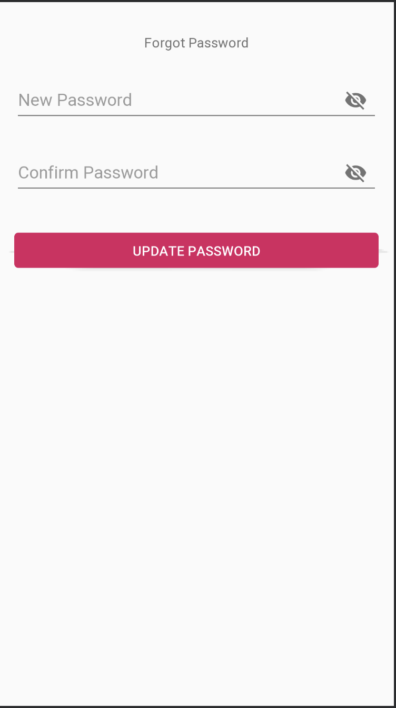

## Module 3

### Intents

Our first part involves making use of Intents. In the project is an activity, `SecondActivity`. This Activity already has a layout associated (`activity_second.xml`) and `SecondActivity` has some of the code it needs to function.

Last time, we just logged/toasted all the information from our initial Activity (the action taken after clicking our Submit button).  Instead of just logging it out, let's go to the `SecondActivity`. When the Submit button is clicked on our first/launch activity, let's create an Intent and pass all that information as Extras to `SecondActivity`.

Let's make sure we're passing:
- the username
- the password
- what the user's preferred font size is (`"Small Font"`, `"Medium Font"`, or `"Large Font"`)
- whether the user saved their username (true/false)
- whether the user saved their password (true/false)
- whether the user shared location (true/false)

### Fragments

Here we'll add a little bit of functionality to our launch/main activity.

#### Part 1: Replacing our first Fragment

First, let's replace our activity with a Fragment.  Check out the `ExampleActivity` for an example of adding a Fragment, and look at the `activity_example.xml` layout (particularly the `fragment_container` view `FrameLayout`).

There's already a `LaunchFragment` on this branch and this Fragment has the same layout and the same functionality as our Launch/Main Activity, so let's get replace the Launch/Main Activity with the LaunchFragment. Make sure you add this to the back stack (see `ExampleActivity` and `ExampleFragment` for an...example).

#### Part 2: Adding a Fragment

Next, let's see how we'd add a *new* Fragment.  We already have a `ForgotPasswordFragment`, so let's use that.  Let's add a `Button` to our `LaunchFragment` and have the text read `Forgot Password`.  Once we click that button, let's replace the `LaunchFragment` with the `ForgotPasswordFragment`. 

Our `ForgotPasswordFragment` already inflates its layout but nothing is really wired up. Let's add an OnClickListener to our button here. For now we can just log out the text in both password fields.

Optional: If you want to try something fun, instead of just logging out the new password, go back to the `LaunchFragment` with the new password and auto-populate the password field with the new password.

