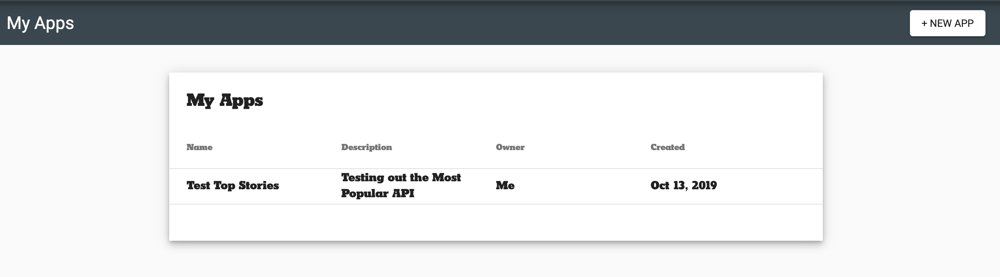
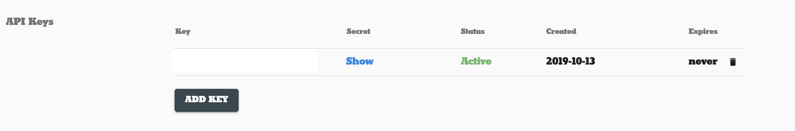

# The Task (tl;dr)

To get some hands-on networking experience, we're going to use the [New York Times Top Stories API](https://developer.nytimes.com/docs/top-stories-product/1/overview).  This API will grab a bunch of articles from the front page of the New York Times for us to use.

Given the NYT Top Stories API, build a screen that fetches data and displays data about the first story returned.


## Set up your NY Times Developer Account

**Before you get started**, you'll need to go to the [NY Times Developer Home](https://developer.nytimes.com/my-apps), register for an account, create a new project, and grab the key from that.

Once you've registered, you can click on your account in the upper right and click on the **Apps** tab. You should then be presented with a page like this (but with no entries under My Apps).  Click the **+ New App** button to start a new app.


Once you've generated a new app, fill out the first fields however you like - the names aren't super important.  You **do** want to make sure that you toggle on the Top Stories API, like so:


Lastly, you may have to click the **ADD KEY** button on this page to generate your API key.  Once generated, it'll look something like this:

.

Keep track of that API key.

Now that we're registered and have our API key, we can dive into some actual code.

## Add our permissions

This should be pretty quick, but we **HAVE** to add some relevant permissions (or make sure they're there already) before we even try and make a network request.  In `AndroidManifest.xml`, add permissions for `INTERNET` and `ACCESS_NETWORK_STATE`.  That looks like this:

```xml
<uses-permission android:name="android.permission.INTERNET" />
<uses-permission android:name="android.permission.ACCESS_NETWORK_STATE" />
```

## Set up our dependencies

To use OkHttp and Retrofit, we'll need to add dependencies for them.  The GSON dependency is already in the repository, so we should be good to go.  If you're building this from elsewhere, then you'll need to include the GSON dependency as well as a couple other files (which we'll note in a moment).

To add Retrofit to your project, look for the `dependencies` block in your `build.gradle` file (the app `build.gradle` rather than project level - if the first line of the file says `apply plugin: 'com.android.application'` then you're in the right spot ).

Add `implementation 'com.squareup.retrofit2:retrofit:2.6.2'` to that `dependencies` block to import the Retrofit library.  

You'll also want to add `implementation "com.squareup.retrofit2:converter-gson:2.6.2"` - this library will let us use GSON with Retrofit.

Lastly, to add OkHttp to the project, add `implementation "com.squareup.okhttp3:okhttp:4.2.1"`.

With those three dependencies, we should be good to go.

If you're working off your own repo/branch, then you'll need to add a few files, so please read the next section, otherwise skip to **Set up API**.

### GSON / other files

To add the GSON dependency, add the line `implementation 'com.google.code.gson:gson:2.8.6'` to the `dependencies` block in your app module `build.gradle`.

Similarly, please look for the files in the `com.willowtree.matthewcorbett.project_sanic.api.model` package.  There should be three files total: `MultimediaResult`, `SearchResponse`, and `SearchResult`.

You may also need to add the `TimesApiService` interface which looks like this:
```java
public interface TimesApiService {
    String BASE_URL = "https://api.nytimes.com/svc/topstories/v2/";
    //TODO: Fill this out
    String API_KEY = "";

    /*
    Possible values for section:
    arts, automobiles, books, business, fashion, food, health, home, insider, magazine, movies,
    national, nyregion, obituaries, opinion, politics, realestate, science, sports, sundayreview,
    technology, theater, tmagazine, travel, upshot, and world.
     */

    //TODO: Add your methods for searching
    //Use this link: https://developer.nytimes.com/docs/top-stories-product/1/overview
}
```

## Set up API

We've got all our dependencies, so let's start setting up the API.  This is where you'll need your API key from our setup on the NYT site.

Paste your API key into the `String API_KEY` field - we'll need to pass this with every request we make.

If we look at [the documentation](https://developer.nytimes.com/docs/top-stories-product/1/overview) for the Top Stories API, our URL is going to look something like `https://api.nytimes.com/svc/topstories/v2/{section}.json`, where `{section}` is one of the listed values (arts, automobiles, etc). Our default should be `home.json` since that will fetch whatever's on the home page.

We've already defined the base URL here as `https://api.nytimes.com/svc/topstories/v2/`, so all we need to provide for our Retrofit calls are the rest of the endpoints - in this case JUST the `{section}.json` part.

We'll first write a method that doesn't pass in any section, so we'll use `home.json`.  That method would look like this (the method name doesn't matter so name it whatever you want)

```java
@GET("home.json")
Call<SearchResponse> search(@Query("api-key") String apiKey);
```

The `@GET` annotation says that we're fetching data (GETting data) and the `home.json` refers to the rest of the path relative to the base URL. When this call is made, it's equivalent to calling our base URL, `https://api.nytimes.com/svc/topstories/v2/` + whatever's specified in the `@GET`, so the full url is `https://api.nytimes.com/svc/topstories/v2/home.json`.  

The return type is `Call<SearchResponse>` - Call is a built-in type from Retrofit that just means it's an HTTP call, and `SearchResponse` is a model that represents the data coming back from the call.  

Lastly, our parameter, `String apiKey` is annotated with `@Query("api-key")`; this means that whatever gets passed in here will be added to the HTTP call as a query parameter with the key `api-key`, so a fully-formed URL would look like `https://api.nytimes.com/svc/topstories/v2/science.json?api-key=<your api key here>`.

Together the whole thing says "this is a GET HTTP call that has an API key as a query parameter and will return data that looks like the data in SearchResponse".

This should do for setting up our API, so let's look at creating our OkHttp and Retrofit instances.

## Creating OkHttp and Retrofit

In our `NewsFragment`, there are two TODOs:
```java
//TODO: Create Retrofit using Retrofit.Builder()

//TODO: Initialize TimesApiService here
```

To create Retrofit, we'll use the `Retrofit.Builder` class. That looks like this:

```java
OkHttpClient client = new OkHttpClient();
Retrofit retrofit = new Retrofit.Builder()
    .baseUrl(TimesApiService.BASE_URL)
    .client(client)
    .addConverterFactory(GsonConverterFactory.create())
    .build();
```

Note that we're also instantiating an `OkHttpClient` - by default Retrofit will provide its own client if you don't specify one, but it's a good habit to make your own client so you can customize it (add timeouts or other configuration options).

The `baseUrl` method will set our base URL - `https://api.nytimes.com/svc/topstories/v2/` in this case.

The `client` method will add our OkHttpClient as the client Retrofit uses.

The `addConverterFactory` method can seem intimidating, but it's basically saying "I want you to add this way of converting from a raw HTTP response to something else".  You'll see we're passing in `GsonConverterFactory.create()` which will create a GSON converter factory for us.  This is the line that tells Retrofit that it can use GSON to help us take HTTP responses and turn them into our model classes.

With a Retrofit instance, we can tackle that other TODO and create our TimesApiService.  Luckily this is pretty simple:

`apiService = retrofit.create(TimesApiService.class);`

With that line, retrofit knows to create an implementation of our `TimesApiService` and will return us an instance.

## Make our API call

With our API set up, we can actually try and make a call.

Making an API call is pretty simple! After we make our API service, let's just call

`apiService.search(TimesApiService.API_KEY)`

You can see we're passing in our API key here.  Just calling the search method here doesn't do much - it gets us a `Call<SearchResponse>` object like we defined in `TimesApiService`; to actually *do anything* with this call, we need to call the `enqueue` method. `enqueue` will asynchronously execute the HTTP call and use the callback we pass to take action after the call finishes.

For now, we can just define a simple callback.  Let's define a field in `NewsFragment` that's of type `Callback<SearchResponse>`:

```java
private Callback<SearchResponse> searchResponseCallback = new Callback<SearchResponse>() {
        @Override
        public void onResponse(Call<SearchResponse> call, Response<SearchResponse> response) {
            Log.d("NYT_SEARCH", response.body().toString());
        }

        @Override
        public void onFailure(Call<SearchResponse> call, Throwable t) {
            Log.d("NYT_SEARCH", t.getLocalizedMessage());
        }
    };
```

This callback just logs out the response body if our call succeeds and logs out the error message if it fails.

To use this callback, make sure we pass it to `enqueue()` like this:
`apiService.search(TimesApiService.API_KEY).enqueue(searchResponseCallback);`

Once we've verified that everything works, let's handle using the data in `onResponse` in our Callback.  Let's do a couple checks first so that our Callback now looks like this:
```java
private Callback<SearchResponse> searchResponseCallback = new Callback<SearchResponse>() {
        @Override
        public void onResponse(Call<SearchResponse> call, Response<SearchResponse> response) {
            //Return early if this response didn't succeed or if the body is null
            if (!response.isSuccessful() || response.body() == null) {
                return;
            }
            //Get our SearchResponse object
            SearchResponse searchResponse = response.body();
            //Return early if we didn't actually get any results
            if (searchResponse.getResults() == null) {
                return;
            }
            SearchResult searchResult = searchResponse.getResults().get(0);
            
            //Update our fields based on that searchResult
        }

        @Override
        public void onFailure(Call<SearchResponse> call, Throwable t) {
            Log.d("NYT_SEARCH", t.getLocalizedMessage());
        }
    };
```

We'll check that the response was successful with `response.isSuccessful()` and that our body isn't null.  We'll also check that we actually got results back.  Once we do that, let's update our TextViews and whatever else based on that single SearchResult we get.