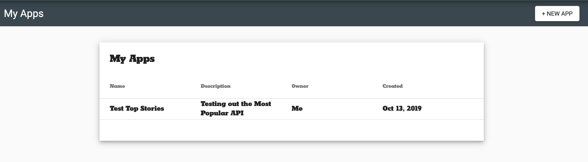
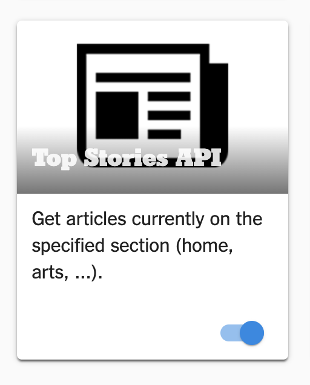
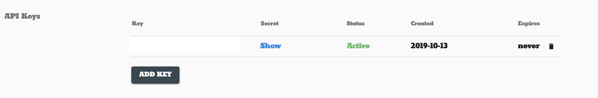

# The Task (tl;dr)

We're going to build on Module 4's task but, instead of just taking the first story from our list of stories, we're going to present the entire list of stories.

Use the [New York Times Top Stories API](https://developer.nytimes.com/docs/top-stories-product/1/overview) to create a list of the stories coming from that API - make each story look however you want.

You only need to set up your NY Times Dev account if you didn't last time - you might need your API key though if you're working from this repo and not your own. If you aren't getting any stories back, **MAKE SURE YOUR API KEY IS SET IN `TimesApiService`**

## Set up your NY Times Developer Account

**Before you get started**, you'll need to go to the [NY Times Developer Home](https://developer.nytimes.com/my-apps), register for an account, create a new project, and grab the key from that.

Once you've registered, you can click on your account in the upper right and click on the **Apps** tab. You should then be presented with a page like this (but with no entries under My Apps).  Click the **+ New App** button to start a new app.


Once you've generated a new app, fill out the first fields however you like - the names aren't super important.  You **do** want to make sure that you toggle on the Top Stories API, like so:



Lastly, you may have to click the **ADD KEY** button on this page to generate your API key.  Once generated, it'll look something like this:

.

Keep track of that API key.

Now that we're registered and have our API key, we can dive into some actual code.

## Update NewsListFragment if needed

You may need to update to use this `NewsListFragment` - you can just copy the class if you need and then update the code in `LaunchActivity` to use `NewsListFragment.newInstance()` rather than `NewsFragment.newInstance()`

You'll also notice that we have a new layout file for the NewsListFragment that looks like this:

```xml
<?xml version="1.0" encoding="utf-8"?>
<android.support.constraint.ConstraintLayout xmlns:android="http://schemas.android.com/apk/res/android"
        xmlns:app="http://schemas.android.com/apk/res-auto"
        android:layout_width="match_parent"
        android:layout_height="match_parent">

    <androidx.recyclerview.widget.RecyclerView
            android:id="@+id/news_list"
            android:layout_width="0dp"
            android:layout_height="0dp"
            app:layout_constraintEnd_toEndOf="parent"
            app:layout_constraintStart_toStartOf="parent"
            app:layout_constraintTop_toTopOf="parent"
            app:layout_constraintBottom_toBottomOf="parent"/>
</android.support.constraint.ConstraintLayout>
```

It's a very simple layout - the RecyclerView (with id `news_list`) takes up the entire parent.  It's already set as a field in NewsListFragment and we've called findViewById to get a reference to it.

## Add a LayoutManager

Look for `#TODO: Set LayoutManager for newsList RecyclerView` - that's where we'll need to initialize our LayoutManager.  The easiest option here is to use a `LinearLayoutManager`.  If we use the constructor that only requires a Context then the LinearLayoutManager will use the default orientation (vertical).

We can add the layout manager with 

```java
newsList.setLayoutManager(new LinearLayoutManager(getContext()));
```

If we run the app now...nothing will show up.  Adding the LayoutManager is just going to tell the RecyclerView how to lay things out - we still haven't told the RecyclerView how to make lists from the data.  We need our Adapter and ViewHolder fleshed out before we can really do much else.

## Create the RecyclerView ViewHolder

We can think of ViewHolders as each individual item in a list, so treat it like we're defining one single entry in a list.

Either create your own class or open the `NewsListViewHolder` class.  Right now this class is completely empty and looks like this:

```java
//TODO: Make this class extend RecyclerView.ViewHolder
public class NewsListViewHolder {
    //TODO: Reference and bind views

    //TODO: Add a way for the ViewHolder to bind data
}
```

The first thing we need to do is make this class `extends RecyclerView.ViewHolder`.  You might see an error after that - that's because we need to create a constructor for RecyclerView.ViewHolder - it forces us to create one that passes in a `View`.

Your constructor can look like this:
```java
public NewsListViewHolder(@NonNull View itemView) {
        super(itemView);
    }
```

All we're doing is calling the superclass's (RecyclerView.ViewHolder) constructor and passing in the view.  Now we also have access to the `itemView` field. The layout file `item_news` represents each news item in our list (feel free to modify this, but we'll go on as if it's as is!). The default looks like this:

```xml
<?xml version="1.0" encoding="utf-8"?>
<android.support.constraint.ConstraintLayout xmlns:android="http://schemas.android.com/apk/res/android"
        android:layout_width="match_parent"
        android:layout_height="wrap_content"
        xmlns:app="http://schemas.android.com/apk/res-auto"
        android:layout_marginTop="8dp"
        android:layout_marginBottom="8dp">

    <TextView
            android:id="@+id/title"
            android:layout_width="wrap_content"
            android:layout_height="wrap_content"
            android:layout_marginBottom="8dp"
            android:gravity="center"
            android:textStyle="bold"
            app:layout_constraintEnd_toEndOf="parent"
            app:layout_constraintStart_toStartOf="parent"
            app:layout_constraintTop_toTopOf="parent" />

    <TextView
            android:id="@+id/author"
            android:layout_width="wrap_content"
            android:layout_height="wrap_content"
            android:layout_marginBottom="8dp"
            android:gravity="center"
            android:textStyle="bold"
            app:layout_constraintEnd_toEndOf="parent"
            app:layout_constraintStart_toStartOf="parent"
            app:layout_constraintTop_toBottomOf="@id/title" />

    <TextView
            android:id="@+id/section"
            android:layout_width="wrap_content"
            android:layout_height="wrap_content"
            android:gravity="center"
            app:layout_constraintEnd_toEndOf="parent"
            app:layout_constraintStart_toStartOf="parent"
            app:layout_constraintTop_toBottomOf="@id/author" />

    <TextView
            android:id="@+id/subsection"
            android:layout_width="wrap_content"
            android:layout_height="wrap_content"
            app:layout_constraintEnd_toEndOf="parent"
            app:layout_constraintStart_toStartOf="parent"
            app:layout_constraintTop_toBottomOf="@id/section" />

    <TextView
            android:id="@+id/article_abstract"
            android:layout_width="wrap_content"
            android:layout_height="wrap_content"
            android:gravity="center"
            app:layout_constraintEnd_toEndOf="parent"
            app:layout_constraintStart_toStartOf="parent"
            app:layout_constraintTop_toBottomOf="@id/subsection" />

</android.support.constraint.ConstraintLayout>
```

There are 5 TextViews: `title`, `author`, `section`, `subsection`, and `article_abstract`. Let's create references to each of these TextViews.  We want to create fields for them and also use `findViewById` to find them in our constructor.  Once you're done, it should look like this:

```java
public class NewsListViewHolder extends RecyclerView.ViewHolder {

    private TextView title;
    private TextView author;
    private TextView section;
    private TextView subsection;
    private TextView articleAbstract;
    
    public NewsListViewHolder(@NonNull View itemView) {
        super(itemView);
        title = itemView.findViewById(R.id.title);
        author = itemView.findViewById(R.id.author);
        section = itemView.findViewById(R.id.section);
        subsection = itemView.findViewById(R.id.subsection);
        articleAbstract = itemView.findViewById(R.id.article_abstract);
    }

    //TODO: Add a way for the ViewHolder to bind data
}
```

Next, we need to add a way for the ViewHolder to map our data to the fields on the screen.  We're going to be working with `SearchResult` so let's create a method called `bind` that takes a `SearchResult`

```java
public void bind(SearchResult searchResult) {

}
```

Now we can just populate all our fields using the appropriate fields in `SearchResult` - `searchResult.getTitle()` for the `title` TextView, etc.
The end result looks like this:

```java
public void bind(SearchResult searchResult) {
        title.setText(searchResult.getTitle());
        author.setText(searchResult.getByline());
        section.setText(searchResult.getSection());
        subsection.setText(searchResult.getSubsection());
        articleAbstract.setText(searchResult.getArticleAbstract());
    }
```

So now our ViewHolder looks like this:

```java
public class NewsListViewHolder extends RecyclerView.ViewHolder {

    private TextView title;
    private TextView author;
    private TextView section;
    private TextView subsection;
    private TextView articleAbstract;

    public NewsListViewHolder(@NonNull View itemView) {
        super(itemView);
        title = itemView.findViewById(R.id.title);
        author = itemView.findViewById(R.id.author);
        section = itemView.findViewById(R.id.section);
        subsection = itemView.findViewById(R.id.subsection);
        articleAbstract = itemView.findViewById(R.id.article_abstract);
    }

    public void bind(SearchResult searchResult) {
        title.setText(searchResult.getTitle());
        author.setText(searchResult.getByline());
        section.setText(searchResult.getSection());
        subsection.setText(searchResult.getSubsection());
        articleAbstract.setText(searchResult.getArticleAbstract());
    }
}
```

We have:
- a way to instantiate our ViewHolder (the constructor)
- fields in our view
- a way to bind data to our view

Now we can work on the Adapter to try and link our RecyclerView and ViewHolder


## Building the Adapter

Our Adapter will help us bridge the gap between the RecyclerView (the list container) and the ViewHolder (the list item).

Either create your own class or open the `NewsListAdapter` class.  Right now this class is completely empty and looks like this:

```java
//TODO: Make this class extend RecyclerView.Adapter and implement methods
public class NewsListAdapter {
}
```

Let's start by making our class `extends RecyclerView.Adapter<NewsListViewHolder>` (or put your ViewHolder class in there instead of `NewsListViewHolder`).  Putting the ViewHolder type in between `<>` is going to inform some of the methods we have to override.  You'll notice an error when we add this and it's because we need to add some methods.

We need to override these methods (where `VH` means our ViewHolder class):

```java
@NonNull
public abstract VH onCreateViewHolder(@NonNull ViewGroup parent, int viewType);
```

```java
public abstract void onBindViewHolder(@NonNull VH holder, int position);
```

and

```java
public abstract int getItemCount();
```

If we just override those with defaults, they should look like this:

```java
public class NewsListAdapter extends RecyclerView.Adapter<NewsListViewHolder> {

    @NonNull
    @Override
    public NewsListViewHolder onCreateViewHolder(@NonNull ViewGroup parent, int viewType) {
        return null;
    }

    @Override
    public void onBindViewHolder(@NonNull NewsListViewHolder holder, int position) {

    }

    @Override
    public int getItemCount() {
        return 0;
    }
}
```

Let's start by fixing `onCreateViewHolder` - we need to make this method return a `NewsListViewHolder`.  To do this, we'll need to invoke NewsListViewHolder's constructor (which takes a View).  We'll:
- create the View used in our cells (the layout file `item_news`)
- create the NewsListViewHolder with that View
- return our ViewHolder

Once finished, `onCreateViewHolder` looks like this:

```java
@NonNull
    @Override
    public NewsListViewHolder onCreateViewHolder(@NonNull ViewGroup parent, int viewType) {
        //Inflate the view
        View view = LayoutInflater.from(parent.getContext()).inflate(R.layout.item_news, parent, false);
        
        //Create the ViewHolder and return it
        return new NewsListViewHolder(view);
    }
```

Next, we'll need to create a reference to our backing data - this is the data that will be used to create our list items.  These will be our `SearchResult`s, so let's create a field in the Adapter - `List<SearchResult> searchResults` and we'll pass it in the Adapter's constructor.  When updated, our Adapter will look like this:

```java
public class NewsListAdapter extends RecyclerView.Adapter<NewsListViewHolder> {
    //Reference to our backing data
    private List<SearchResult> searchResults;
    
    //Passing in the List via constructor and setting it to our field
    public NewsListAdapter(List<SearchResult> searchResults) {
        this.searchResults = searchResults;
    }
    
    @NonNull
    @Override
    public NewsListViewHolder onCreateViewHolder(@NonNull ViewGroup parent, int viewType) {
        //Inflate the view
        View view = LayoutInflater.from(parent.getContext()).inflate(R.layout.item_news, parent, false);

        //Create the ViewHolder and return it
        return new NewsListViewHolder(view);
    }

    @Override
    public void onBindViewHolder(@NonNull NewsListViewHolder holder, int position) {

    }

    @Override
    public int getItemCount() {
        return 0;
    }
}
```

Now that we have our backing data, let's tackle `onBindViewHolder` - we already defined a `bind` method in our ViewHolder, so this is fairly straightforward.  We'll use the `position` variable to get the news item from our backing data and pass it to the ViewHolder's `bind` method.  Once you finish that, it should look similar to this:

```java
@Override
    public void onBindViewHolder(@NonNull NewsListViewHolder holder, int position) {
        SearchResult searchResult = searchResults.get(position);
        holder.bind(searchResult);
    }
```

Lastly, in our adapter, we'll override `getItemCount()` - this method will tell the RecyclerView how many items are in the list.  Since our backing data is just our list, we can return the size of that list.  Just to be safe, if the list is null we'll return 0.  Once you finish that, it should look like this:

```java
@Override
    public int getItemCount() {
        if (searchResults != null) {
            return searchResults.size();
        } else {
            return 0;
        }
    }
```

Now we have our RecyclerView, our Adapter, and our ViewHolder - let's put them together!

## Putting it all together

From our `NewsListFragment`, look for the `//TODO: Set data for RecyclerView Adapter (and set the Adapter to the RecyclerView)`.  All we need to do here is to:
- create the adapter
- set the adapter to our RecyclerView

That looks like this:

```java
//Create our adapter, passing in our search results
NewsListAdapter adapter = new NewsListAdapter(searchResponse.getResults());
            
//Set the adapter to our RecyclerView
newsList.setAdapter(adapter);
```

Now let's run our app and see all these list items will display!  We can mess around with it now. Below are a few ideas

## Extra Credit Bonus Ideas

- On long click of a list item, delete an item from the list (this requires using an `OnLongClickListener` on the itemView, updating your backing data, and `notifyDataSetChanged()`)
- On click of a list item, go to another Fragment that shows the details of that story.
- Try using a `GridLayoutManager` instead of `LinearLayoutManager`